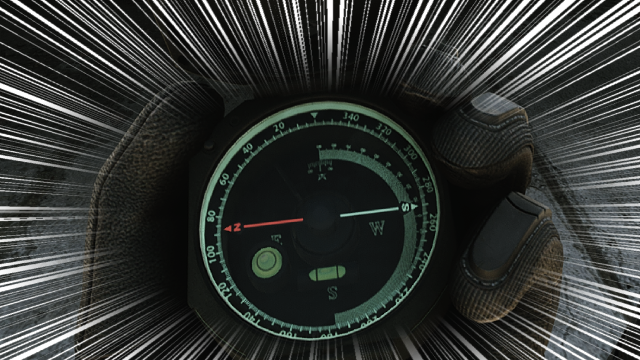
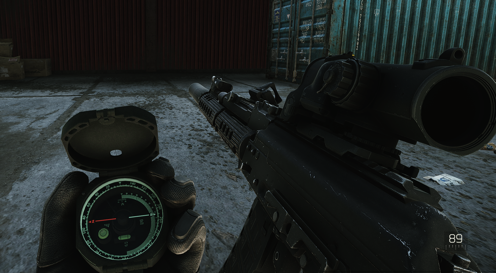
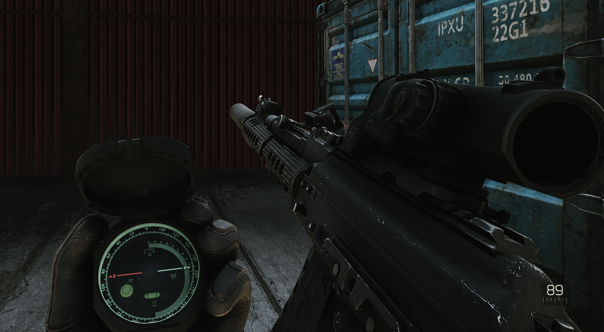
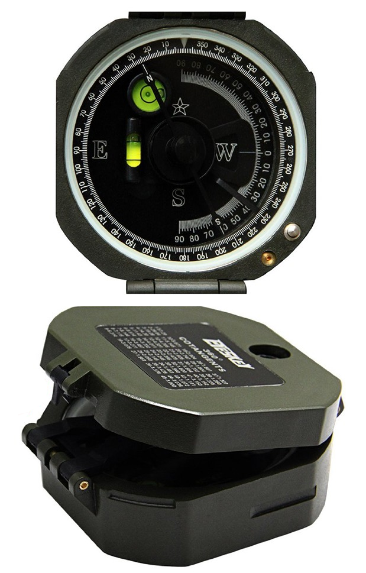

Correctin' Compasses (for JET Client 12.9.10988)
----------------
Version `1.1.0` (`03.18.2021`)
By Kyodan

This client mod corrects the cardinal direction markings of the compass!
                                                                                   
## Info

- By default, this mod will apply a texture fix to the compass that corrects the cardinal directions by swapping the East and West cardinal direction markings.

For whatever reason, the compass (which is based on the Brunton compass) correctly displays the azimuth (the North arrow and the azimuth reading on the bottom right of the screen match up), but the 'East' and 'West' markings were not swapped. 

**Wrong markings - facing East (azimuth ~90) on Customs:**
 

**Fixed markings - facing East (azimuth ~90) on Customs:**

**Picture of the real compass (look at the cardinal markings):**

## Installation

1. Download and install the latest version of Melonloader: https://github.com/HerpDerpinstine/MelonLoader/releases/latest/download/MelonLoader.Installer.exe
* Version 1.0.2 of the `Bundle Loader` mod by AppeaseTheCheeze is included (needed for this mod to work). Check if there are new releases here: https://configfreaks.com/download/bundle-loader/
2. Run the JET Launcher and connect to your server, then quit the client (to create the necessary folders in your client folder)
2. Extract archive to your `client folder/Mods` folder 
    * Folder structure should look like `client folder/Mods/Bundles/Local/Compass_Fix`
2. Run the JET Launcher and connect to your server

## Files

- If any of the files below are missing/misplaced, you may have to redownload/reinstall this archive:
    * `Bundles\Local\Compass_Fix\item_compass.bundle`

## Need help?

1. Join the EmuTarkov Discord: https://discord.gg/33r4FPp
2. @ me in the #support channel which script + version, what the issue is, and a picture/log of that issue (if possible)

## Disclaimer

I am not responsible for any data loss in relation to the use of this mod (including, but not limited to game/profile data and/or content loss, damage caused to your software, computer, or mobile device). I encourage you to back up your server/profile data before using this mod.

## Changelog

- 03.18.21
    * Initial push to Github
